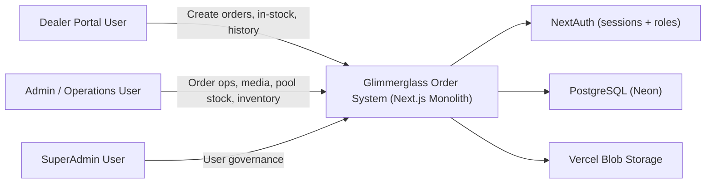
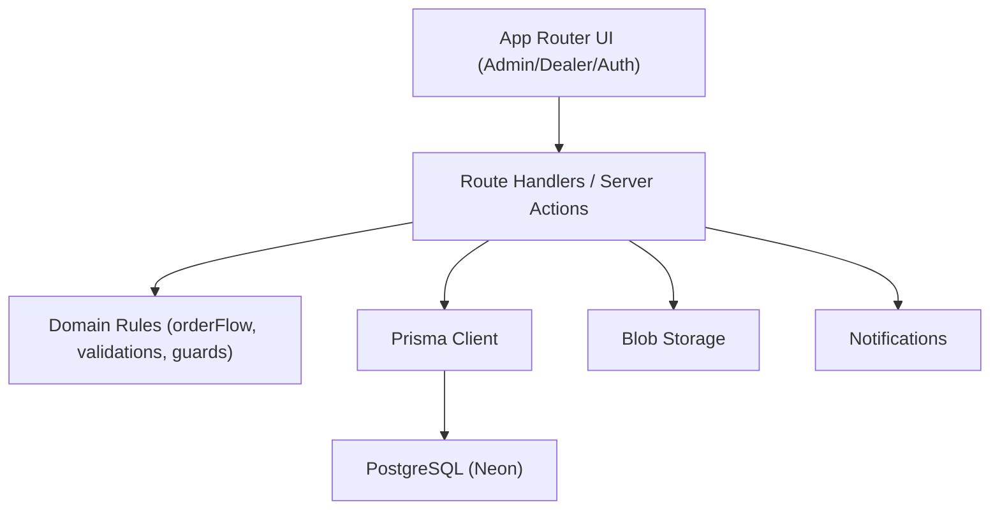
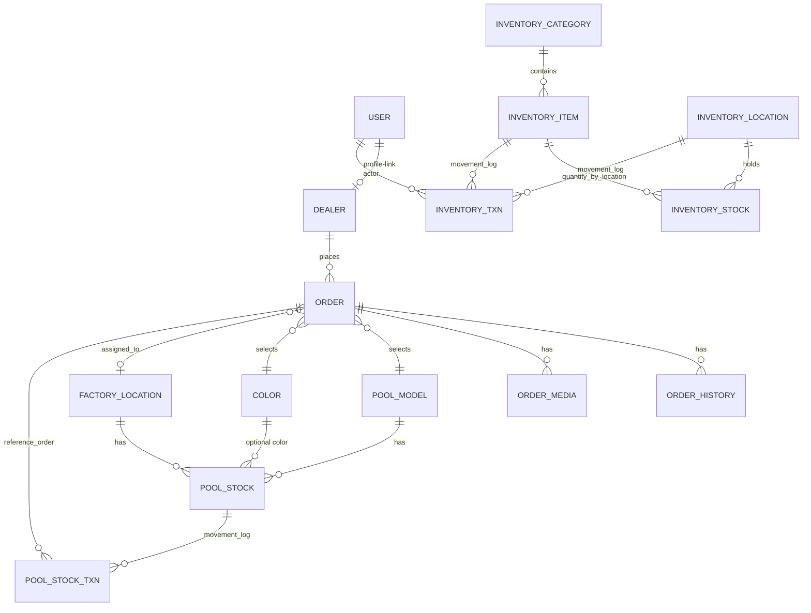
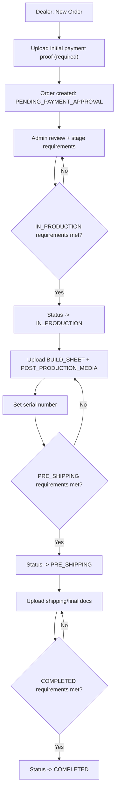
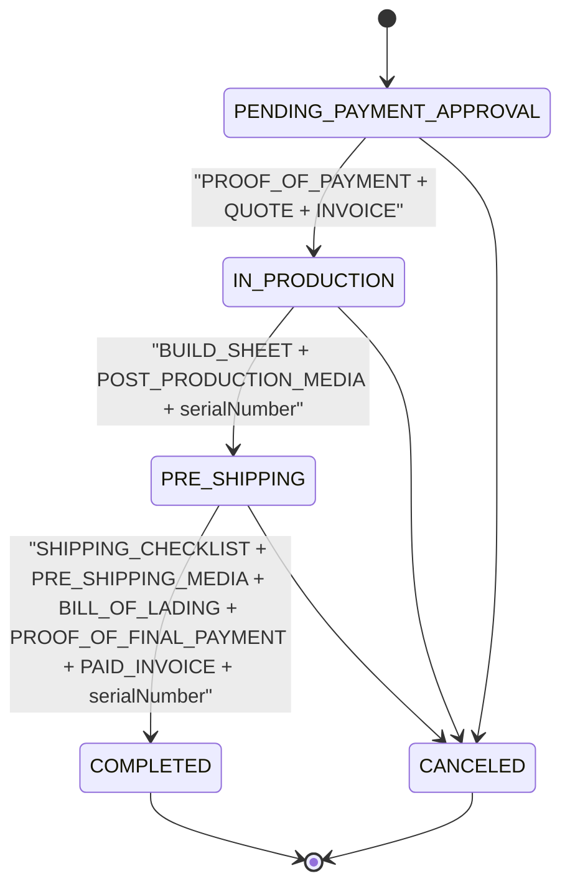
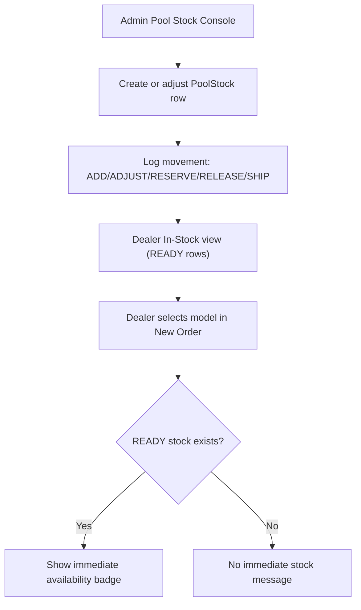
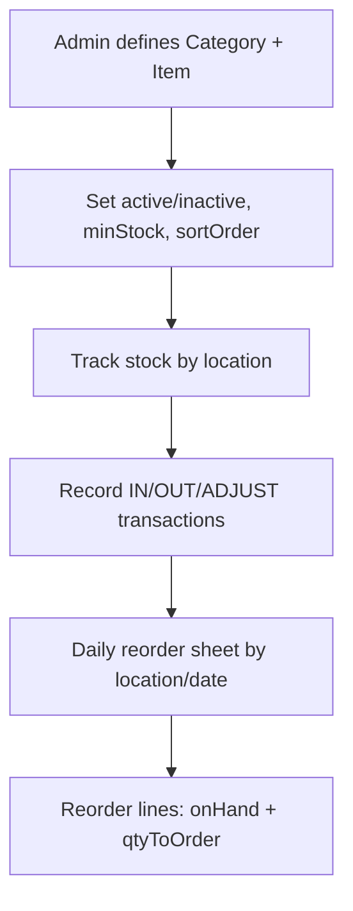
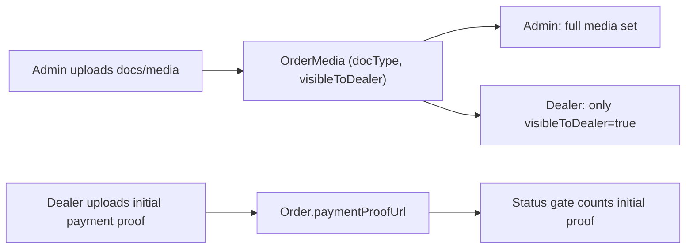
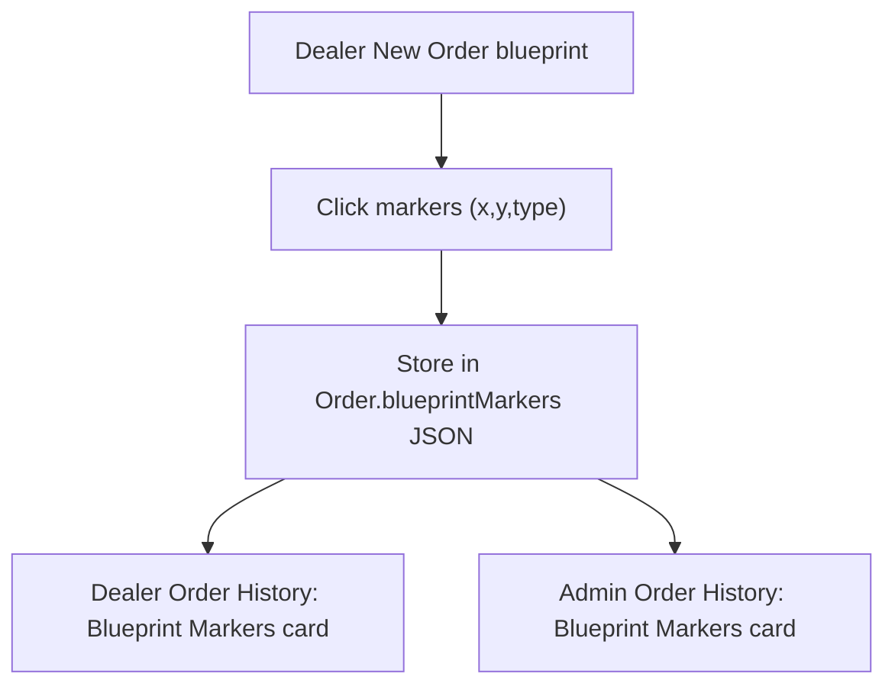

# Glimmerglass Order System - Architecture & Flow Diagrams

Reference date: **2026-02-17**

## 1) System context

## 2) Internal monolith blocks

## 3) Domain map (high level)

## 4) Main order lifecycle

## 5) Status gates

## 6) Finished pool stock flow

## 7) Material/supplies inventory flow

## 8) Files visibility flow

## 9) Blueprint marker flow

