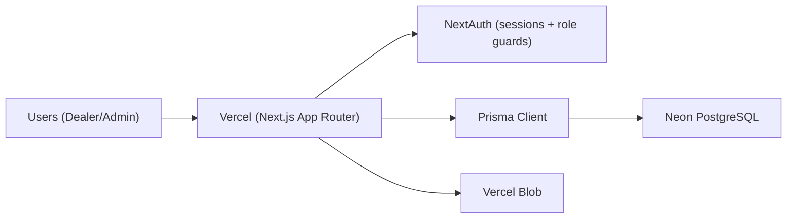
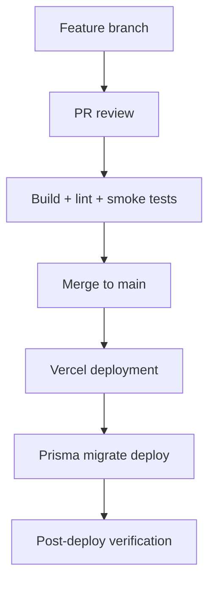

# Glimmerglass Order System - DevOps Blueprint

Date: 2026-02-17  
Audience: Engineering, DevOps, Production Support

## 1) Runtime topology



## 2) Environment model

- `local`: developer machine using `.env.local`.
- `preview`: Vercel preview deploy (PR/branch), staging database.
- `production`: Vercel prod deploy, Neon production database.

Rules:
- Never run `prisma migrate dev` against production.
- Run only `prisma migrate deploy` in production.

## 3) Critical environment variables

- `DATABASE_URL`
- `NEXTAUTH_SECRET`
- `NEXTAUTH_URL`
- `BLOB_READ_WRITE_TOKEN`

Minimum controls:
- Variables are set in both Vercel Preview and Production.
- Secrets rotation policy is defined and executed.
- Local credentials are least-privileged and time-limited where possible.

## 4) Release pipeline (recommended)



Post-deploy verification:
- Admin and dealer login.
- New order creation.
- Status transition gate checks.
- Pool stock read/write.
- Blob upload/open path.

## 5) Prisma + Neon migration strategy

Development:

```bash
npx prisma generate
npx prisma migrate dev --name <migration_name>
```

Production:

```bash
npx prisma migrate deploy
```

Guardrails:
- Keep migrations additive by default.
- Validate indexes and lock impact before high-traffic windows.
- Take pre-change logical backup for high-risk schema changes.

## 6) Observability baseline

Application:
- 5xx rate by route.
- Error volume on order/status endpoints.

Business:
- Orders per status.
- Blocked transitions due to missing requirements.

Database:
- Query latency, connection pressure, lock/deadlock events.

Storage:
- Blob upload/download failures and latency.

## 7) Security operations

- Strict RBAC (`ADMIN`, `DEALER`, `SUPERADMIN`) on API + UI.
- Server-side validation for status transitions and required documents.
- Dealer file visibility controlled by `visibleToDealer`.
- Input validation and upload constraints.

## 8) Incident runbook (condensed)

Case A - Database connectivity failure:
1. Check Neon status and `DATABASE_URL`.
2. Check connection saturation.
3. Apply read-only fallback where possible.
4. Escalate based on order write impact.

Case B - Blob upload failure:
1. Validate `BLOB_READ_WRITE_TOKEN` in Vercel env.
2. Redeploy if env refresh is required.
3. Verify upload from admin catalog and pool stock screens.

Case C - Status transition rejection:
1. Inspect missing docs/fields payload from status endpoint.
2. Verify `OrderMedia` records and `serialNumber`.
3. Confirm initial dealer payment proof handling (`order.paymentProofUrl`).

## 9) Backup and recovery target

- Daily logical backup policy for production DB.
- Monthly restore drill in staging.
- Suggested SLO:
- `RPO <= 24h`
- `RTO <= 4h`

## 10) Scale strategy (within monolith)

- Keep monolith architecture.
- Prioritize query optimization and indexes.
- Prevent N+1 patterns.
- Paginate heavy admin lists.
- Add selective caching for hot read paths.

## 11) Pre-release hard gate checklist

1. `npm run build` passes.
2. Migrations tested in staging.
3. End-to-end smoke tests pass.
4. Vercel environment variables verified.
5. Rollback steps documented.
