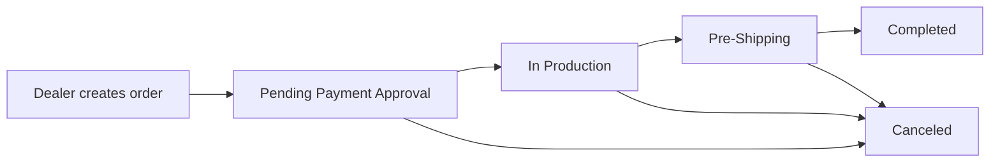

# Glimmerglass Order System - Executive Brief

Date: 2026-02-17  
Audience: Leadership, Operations, Sales, Production

## 1) What this platform is

A production-grade operational system for the full fiberglass pool order lifecycle:
- Dealer order intake.
- Admin workflow control with document gates.
- Finished pool stock visibility by factory.
- Raw/supplies inventory tracking by location.

## 2) Business value

- Reduces friction between dealer, admin, and factory teams.
- Avoids unnecessary production by surfacing ready finished stock.
- Enforces process control with stage-based requirements.
- Improves traceability for compliance and internal accountability.

## 3) Business lifecycle (summary)

## 4) Core operating modules

- **Orders & Status Flow**: end-to-end order progression with required evidence.
- **Pool Stock (Finished Goods)**: by factory/model/color/status.
- **Dealer In-Stock**: immediate sellable inventory visibility.
- **Pool Catalog**: model images + blueprint assets.
- **Blueprint Markers**: skimmer/return/drain points stored per order.
- **Inventory (Materials/Supplies)**: categories, items, stocks, transactions, daily reorder sheets.

## 5) Executive KPI set (recommended)

- End-to-end order lead time (`PENDING_PAYMENT_APPROVAL -> COMPLETED`).
- % of orders blocked by missing documents.
- % orders fulfilled from finished stock (without new production).
- Inventory health: on-hand vs minStock by location.
- Requested ship date compliance.

## 6) Current risk areas and mitigations

- Manual document dependency:
  enforce stage checklists and visible missing-items prompts.
- Data drift from ad-hoc setups:
  govern category/item lifecycle (create/deactivate ownership).
- Transition errors:
  keep server-side validation as single source of truth.

## 7) Maturity assessment

- Strong operational base already in place.
- Correct structural decision: `PoolStock` is separated from `Inventory`.
- Immediate next maturity step: stronger DevOps discipline and observability.

## 8) 30-60 day executive decisions

1. Approve SLA targets per order stage.
2. Approve operations dashboard with production/stock/document KPIs.
3. Define governance policy for catalog and inventory master data.
4. Formalize release and incident runbooks to reduce downtime risk.
